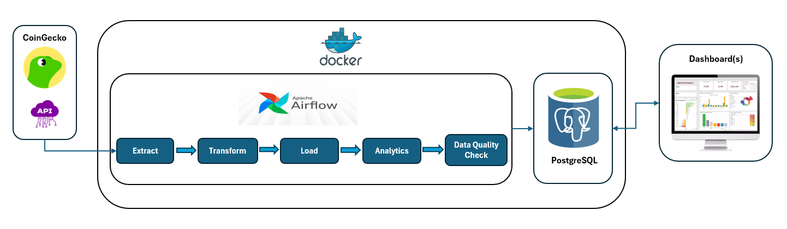
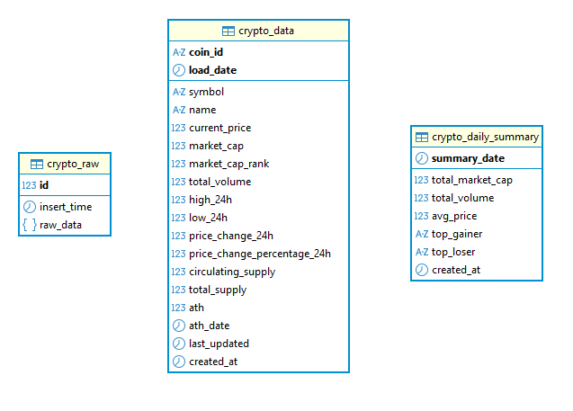
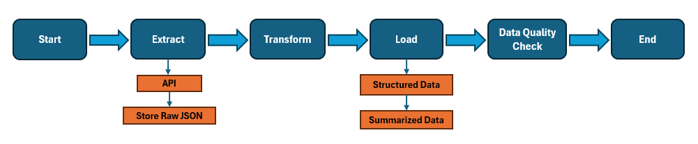
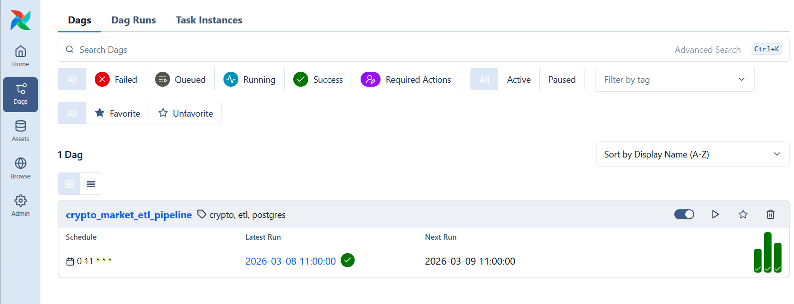
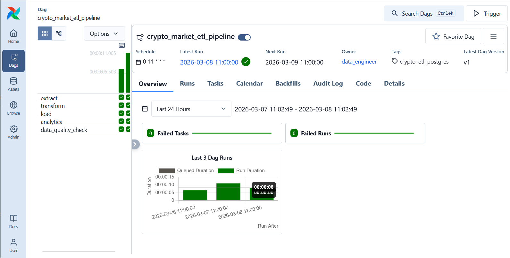
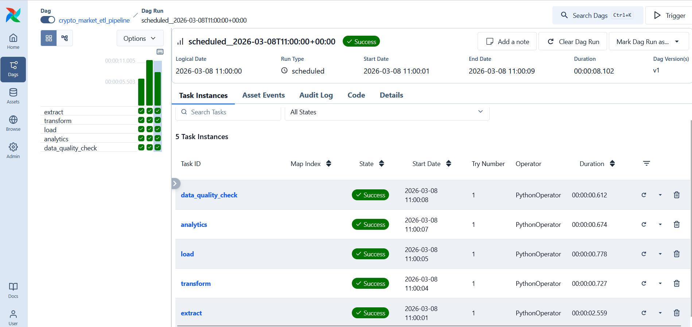

# 🚀 Project: Cryptocurrency Market ETL Pipeline

## Table of Contents
- [Project Overview](#overview)
- [Architecture Overview](#architecture)
- [Project Structure](#project-structure)
- [Database Schema](#database-schema)
- [DAG Structure](#dag-structure)
- [Installation and Setup](#installation-and-setup)
- [ETL Workflow](#etl-workflow)
- [Dashboard](#dashboard)
- [ScreenShots](#screenshots)

### Project Overview

This project implements an ETL pipeline that extracts daily cryptocurrency market data from the public CoinGecko API, transforms the raw JSON data using Python and loads it into PostgreSQL. The workflow is automated using Apache Airflow, runs on a daily schedule and deployed using Docker.

Build an ETL pipeline that:
- Extracts cryptocurrency market data via API
- Clean and transform the JSON raw data
- Load the structured data into PostgreSQL
- Use Airflow to automate and schedule the workflow
- Stores logs
- Data quality check
- Containerized deployment

### Architecture Overview


### Project Structure
```text
crypto_market/
│
├── config/
│
├── dags/
│   └── crypto_market_etl_dag.py
│
├── logs/
│
├── plugins/
│
├── postgres/
│   └── airflow_init.sql
│
├── scripts/
│   ├── extract.py
│   ├── transform.py
│   ├── load.py
│   ├── anaalytics.py
│   └── quality_check.py
│
├── sql/
│   └── create_tables.sql
│
├── .env
├── docker-compose.yml
├── requirements.txt
└── README.md
```

### Database Schema


### DAG Structure


### Installation and Setup
```text
# 1. Create Required Folders
    - mkdir -p ./dags ./logs ./plugins ./config ./sql ./postgres
```
```text
# 2. Configure environment variables
    - Edit .env with the necessary credentials & parameters

    AIRFLOW_UID=50000
    AIRFLOW_PORT=8000
`
    POSTGRES_HOST=%host%
    POSTGRES_DB=%database_name%
    POSTGRES_USER=%username%
    POSTGRES_PWD=%user_pwd%
    POSTGRES_PORT=%port%
```
```text
# 3. Create and activate Virtual Environment
    - python -m venv your_venv
    - source your_env/bin/activate # Linux
    - your_env\Scripts\activate #Windows
```
```text
# 4. Install the required dependencies.
    - pip install -r requirements.txt
```
```text
# 5. Setup and run Docker Containers (PostgreSQL & Airflow)
    - docker compose -f docker-compose.yml up -d
```
```text
# 6. Setup Crypto database tables
    - psql -h %host% -p %port% -U %username% -d %database_name% -f sql/create_tables.sql
```

### ETL Workflow

**Extract**
- Call CoinGecko API /coins/markets endpoint
- Retrieves top 100 cryptocurrencies by market cap
- Validates HTTP status
- Store raw JSON into crypto_raw
- Pushes JSON data via Airflow XCom

**Transform**
- Converts JSON to Pandas DataFrame
- Normalizes timestamp fields/columns
- Clean null numeric values
- Remove duplicates
- Add load_date

**Load**
- Load cleaned data into crypto_data
- create summary aggregation
- Insert into crypto_daily_summary

### Dashboard

"# Cryptocurrency" 

### ScreenShots


|
